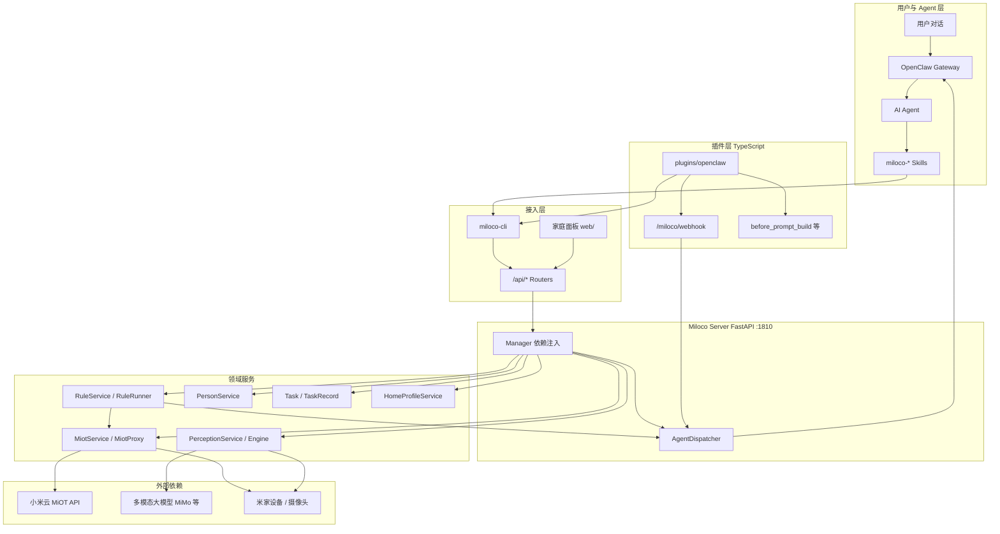

# Xiaomi Miloco — 项目开发文档

> **Fork 专属**：本文档仅用于 [traceless929/xiaomi-miloco](https://github.com/traceless929/xiaomi-miloco) 本地开发，不提交至官方上游。  
> 官方架构细节仍以 [knowledge/](../knowledge/) 为准；本文侧重**结构地图 + 开发落地**。

---

## 1. 项目定位与作用

**Miloco 2.0** 是运行在用户家庭本地（Mac mini / NUC / Linux 等）的全屋智能 AI 平台：

| 角色 | 说明 |
|------|------|
| **感知网关** | 米家摄像头音视频 → 结构化事件（谁在场、发生了什么、说了什么） |
| **设备中枢** | 通过 MiOT 协议控制米家设备、触发场景 |
| **规则与任务引擎** | 自然语言条件规则 + 长期家庭任务（定时、统计、自动化） |
| **Agent 能力底座** | OpenClaw 插件 + Skill，把上述能力暴露给大模型 Agent |
| **用户界面** | Web 家庭面板 + `miloco-cli` 命令行 |

一句话：**本地 Server 负责「感知 + 设备 + 规则 + 记忆」闭环；OpenClaw Agent 负责「听懂用户、主动决策、调用 Skill」。**

---

## 2. 系统架构总览



### 运行时进程关系

| 进程 | 启动方式 | 作用 |
|------|----------|------|
| **Miloco Server** | `miloco-cli service start` 或 `uv run task dev` | 单进程 FastAPI + 感知/规则后台 Runner |
| **OpenClaw Gateway** | `openclaw gateway`（用户环境） | Agent 运行时；加载 Miloco 插件 |
| **Vite Dev**（仅开发） | `cd web && pnpm dev` | 前端热更新，代理 `/api` |

默认监听：`http://127.0.0.1:1810`（`server.host` / `server.port` 可改）。

---

## 3. 仓库结构

```
xiaomi-miloco/
├── backend/                    # Python uv workspace
│   ├── miloco/                 # 主服务包 miloco
│   │   └── src/miloco/         # FastAPI 应用（见 §4）
│   └── miot/                   # MiOT SDK 子包（设备协议）
├── cli/                        # miloco-cli（Click + httpx）
├── plugins/
│   ├── openclaw/               # OpenClaw 插件（TS，构建产物 + skills 副本）
│   └── skills/                 # Skill 契约唯一源（miloco-* × 16）
├── web/                        # 家庭面板 SPA
├── knowledge/                  # 官方知识库（模块设计、L1/L2）
├── scripts/                    # build / install / 工具脚本
├── .agents/commands/           # 官方 Agent 命令（如 review-pr）
├── docs/                       # 【Fork 专属】本开发文档
├── AGENTS.md                   # 【Fork 专属】AI 助手速查
└── .cursor/rules/              # 【Fork 专属】Cursor 规则
```

### 构建产物（`dist/`）

`scripts/build.sh` 可产出：

| 包 | 产物 |
|----|------|
| miloco-miot | platform wheel |
| miloco | backend wheel |
| miloco-cli | CLI wheel |
| openclaw | `miloco-openclaw-plugin-*.tgz` |
| web | 静态资源 → 安装时同步到 `$MILOCO_HOME/static/` |

---

## 4. 后端模块地图（`backend/miloco/src/miloco/`）

### 4.1 分层约定

```
HTTP Request
  → middleware（鉴权、异常）
  → router.py（参数校验）
  → service.py（业务编排）
  → runner.py（可选，长循环）
  → database/*_repo.py 或 外部 proxy（MiotProxy / PerceptionEngineProxy）
```

`manager.py` 的 `Manager` 单例在 `lifespan` 中初始化全部 Service，各 Router 通过 `get_manager()` 访问。

### 4.2 领域目录

| 目录 | 职责 | Router 前缀 |
|------|------|-------------|
| `miot/` | 米家账号、设备列表、控制、场景、scope | `/api/miot` |
| `perception/` | 感知引擎启停、日志、摄像头 scope、事件 | `/api/perception` |
| `rule/` | 规则 CRUD、触发日志 | `/api/rule` |
| `person/` | 成员、生物特征注册 | `/api/person` |
| `home_profile/` | 家庭档案 `profile.md`、候选知识 | `/api/home-profile` |
| `task/` | 家庭任务生命周期 | `/api/task` |
| `task_record/` | 任务行为统计（progress/duration/event） | `/api/task-record` |
| `dispatch/` | `AgentDispatcher`，后端 → Agent 事件队列 | （内部，无独立 router） |
| `admin/` | 状态聚合、token 用量、debug | `/api/admin` |
| `observability/` | 性能 trace、agent run 元数据 | `/api/observability` |
| `node_monitor/` | 节点健康、watchdog | `/api/monitor` |
| `database/` | SQLite schema + 各 Repo | — |
| `config/` | `MilocoSettings`、YAML、schema.json | — |

### 4.3 感知引擎子包（`perception/engine/`）

四层流水线（核心编排：`perception/engine/api.py` → `PerceptionEngine`）：

```
MultimodalCollector（采集窗口）
  → Gate（帧差 / 音频能量，过滤静止）
  → Identity（DeepSORT + 人脸/ReID，track → person_id）
  → Omni（VLM：场景描述、规则匹配、语音、建议）
```

- **Runner**：`perception/runner.py` 周期触发采集与推理  
- **Proxy**：`perception/client.py` 隔离引擎进程内状态，供 Service 调用  
- **规则联动**：Omni 输出 → `RuleRunner.update_state` → STATIC 直控设备 / DYNAMIC 回调 Agent  

### 4.4 持久化（`miloco.db`，18 张业务表）

主要表（定义见 `database/connector.py`）：

| 表 | 用途 |
|----|------|
| `kv` | 系统 KV（token、scope、OAuth 等） |
| `person` / `biometric` | 成员与生物特征 |
| `perception_log` / `meaningful_events` | 感知日志与有价值事件（含视频片段索引） |
| `rule` / `rule_log` | 规则与触发记录 |
| `task` / `task_link` | 任务主体与挂载（rule/cron/record） |
| `task_record_*` | 进度 / 时长 / 事件型统计 |
| `token_usage` / `token_usage_daily` | LLM 用量明细与汇总 |
| `device_lru` | 设备相关 LRU 缓存 |

另：`observability.db` 存性能 trace（`perf.enabled` 控制）。

---

## 5. 四条主链路（开发时对照）

### 5.1 设备控制

```
Agent Skill / CLI / Web
  → POST /api/miot/devices/{did}/control
  → MiotService（scope 校验）
  → MiotProxy → 小米云或 LAN → 设备
```

### 5.2 感知 → 规则 → 设备 / Agent

```
摄像头流 → Collector → Gate → Identity → Omni
  → RuleRunner
      ├─ STATIC  → MiotProxy → 设备
      └─ DYNAMIC → AgentDispatcher → OpenClaw webhook → Agent → Skill
```

### 5.3 Agent 指令（用户主动）

```
用户 → OpenClaw Agent → miloco-* Skill
  → miloco-cli → POST /api/*（Bearer token）
  → 对应 Service
```

### 5.4 家庭记忆

```
感知日志 / 对话 / Cron（home-patrol 等）
  → HomeProfileService → $MILOCO_HOME/home-profile/profile.md
  ├─ 插件 hooks/prompt.ts → Agent system prompt
  └─ home_profile_loader.py → Omni prompt 动态层
```

---

## 6. OpenClaw 插件层（`plugins/openclaw/`）

入口：`src/index.ts`，注册顺序有依赖（`loadSharedConfig` 必须在 `registerServices` 之前，写入 `agent.auth_bearer`）。

| 子模块 | 路径 | 作用 |
|--------|------|------|
| 配置同步 | `miloco/config.ts` | 与 `$MILOCO_HOME/config.json` 对齐 |
| Webhook | `webhooks/` | 接收后端 `AgentDispatcher` 推送 |
| Hooks | `hooks/` | `before_prompt_build` 注入家庭档案 |
| Services | `services/` | 后端拉起、健康探测等 |
| Tools | `tools/notify.ts` | 插件级 notify 工具 |
| Home Profile | `home-profile/` | 档案建议、晋升逻辑 |

**Skill 开发**：只编辑 `plugins/skills/<name>/SKILL.md`，构建时复制到 `plugins/openclaw/skills/`。  
16 个 Skill 列表见 [AGENTS.md](../AGENTS.md#openclaw-skill-清单)。

---

## 7. CLI（`cli/src/miloco_cli/`）

入口：`main.py`，默认 JSON 输出，`--pretty` 缩进。

| 命令组 | 文件 | 典型用途 |
|--------|------|----------|
| `service` | `commands/service.py` | 启停守护进程 |
| `config` | `commands/config.py` | 读写 `config.json` |
| `account` | `commands/account.py` | 绑定小米账号 |
| `device` / `scene` | `commands/device.py` 等 | 设备与场景 |
| `scope` | `commands/scope.py` | 家庭 / 摄像头感知范围 |
| `perceive` | `commands/perceive.py` | 感知查询 |
| `rule` / `task` | `commands/rule.py` 等 | 规则与任务 |
| `person` / `identity` | `commands/person.py` 等 | 成员与身份 |
| `home-profile` | `commands/home_profile.py` | 家庭档案 |
| `admin` / `monitor` / `doctor` | 运维与诊断 |
| `dashboard` | `commands/dashboard.py` | 打开 Web 面板 |

CLI 通过 httpx 调本地 Server，鉴权头来自 `server.token`。

---

## 8. 家庭面板（`web/`）

| 部分 | 说明 |
|------|------|
| 入口 | `src/main.tsx` → `App.tsx` |
| API | `src/api.ts`（封装 `/api` 调用） |
| 路由 | Tab：`now` / `devices` / `family` / `activity` / `usage`；`#perf` 独立性能页 |
| i18n | `src/i18n/`（中/英） |
| 样式 | Tailwind + `knowledge/07-design/` 设计规范 |

生产环境：构建到 `web/dist/`，由 `main.py` 的 SPA handler 伺服，**无独立前端进程**。  
开发：`pnpm dev` 代理 API 到 backend。

---

## 9. 配置与运行时目录

### 配置优先级（高 → 低）

1. 环境变量 `MILOCO_*`（嵌套 `__`）
2. `$MILOCO_HOME/config.json`
3. `backend/.../config/settings.yaml`
4. 代码默认值

核心段：`server` / `agent` / `model.omni` / `miot` / `perception` / `rule` / `perf`  
用户面向 schema：`settings.schema.json`（仅部分段）。

### 默认路径

| 变量 / 路径 | 默认 | 内容 |
|-------------|------|------|
| `$MILOCO_HOME` | `~/.openclaw/miloco` | 工作根目录 |
| `config.json` | 上述目录下 | 三端共享配置 |
| `miloco.db` | `storage/` 下 | 业务 SQLite |
| `static/` | 前端构建产物 | SPA 资源 |
| `home-profile/profile.md` | 家庭记忆正文 | Agent + Omni 消费 |
| `log/` | 服务与 CLI 日志 | — |

---

## 10. 开发工作流

### 10.1 环境准备

```bash
bash scripts/install.sh --dev    # 推荐：构建 + 本地安装
# 或分步见 knowledge/06-dev-guide/dev-guide.md
```

### 10.2 日常开发命令

```bash
# Backend
cd backend && uv sync --all-groups
uv run task dev                  # 前台 :1810
uv run task test && uv run task lint && uv run task check

# CLI（改完可直接 uv run，不必重装）
cd cli && uv run miloco-cli admin status

# 插件 + Skill
cd plugins/openclaw && pnpm run build && pnpm test
openclaw plugins install .
openclaw gateway restart

# Web
cd web && pnpm dev
```

### 10.3 改功能时建议路径

| 目标 | 主要改动位置 | 同步更新 |
|------|--------------|----------|
| 新 HTTP API | `*/router.py` → `service.py` → `repo` | OpenAPI 消费方、CLI、Skill |
| 感知逻辑 | `perception/engine/` | `knowledge/03-features/perception-pipeline.md` |
| 规则行为 | `rule/runner.py` | `rule-automation.md`、相关 Skill |
| Agent 能力 | `plugins/skills/*/SKILL.md` + 插件 TS | `openclaw-integration.md` |
| 面板 UI | `web/src/components/` | `07-design/` 规范 |
| 配置项 | `settings.py` + `settings.yaml` | `settings.schema.json`（若用户可配） |

### 10.4 向官方贡献 PR

```bash
git fetch upstream
git checkout -b feat/xxx upstream/main
# 仅提交业务改动，不带 docs/、AGENTS.md、.cursor/
bash scripts/check-upstream-pr.sh
gh pr create -R XiaoMi/xiaomi-miloco --base main
```

---

## 11. 测试与质量

| 范围 | 命令 | 位置 |
|------|------|------|
| Backend | `uv run task test` | `backend/miloco/tests/` |
| CLI | `uv run pytest` | `cli/tests/` |
| 插件 | `pnpm test` | `plugins/openclaw/` |
| Web | `pnpm test` / `pnpm typecheck` | `web/` |
| CI | `.github/workflows/ci.yml` | 全仓 |

**约束**：Server **不支持** `workers > 1`；单进程假设贯穿感知、监控、SQLite。

---

## 12. 横切能力速查

| 能力 | 模块 | 说明 |
|------|------|------|
| 健康检查 | `/health` | 节点 FAILED/STALLED → 503；PREREQ_MISSING 仍 200 |
| 节点监控 | `node_monitor/` | camera / engine / rule 等生命周期 |
| 事件调度 | `dispatch/dispatcher.py` | 单 session 单飞、合并、优先级淘汰 |
| 鉴权 | `middleware/` + `server.token` | Bearer；SPA 内嵌 token（LAN 开放需评估风险） |
| Token 用量 | `admin/` + `token_usage_repo` | 面板「模型」页 |
| 清理任务 | `main.py` `_log_cleanup_loop` | 日志 TTL、截图 LRU、observability 表 |

---

## 13. 文档分工

| 来源 | 读者 | 内容粒度 |
|------|------|----------|
| **本文 `docs/DEVELOPMENT.md`** | Fork 本地开发者 | 结构地图、链路、改哪里 |
| **`knowledge/`** | 全员 / 上游 PR | 模块设计 L1/L2、设计决策「为什么」 |
| **`AGENTS.md`** | AI 助手 | 命令、远端、PR 排除规则 |
| **代码 / schema / `--help`** | 实现细节 | 字段默认值、函数流程（单一事实源） |

---

## 14. 相关链接

- 官方仓库：[XiaoMi/xiaomi-miloco](https://github.com/XiaoMi/xiaomi-miloco)
- 本 fork：[traceless929/xiaomi-miloco](https://github.com/traceless929/xiaomi-miloco)
- OpenClaw：[openclaw.ai](https://openclaw.ai)
- 用户手册：[user_guide_zh.md](../user_guide_zh.md)
