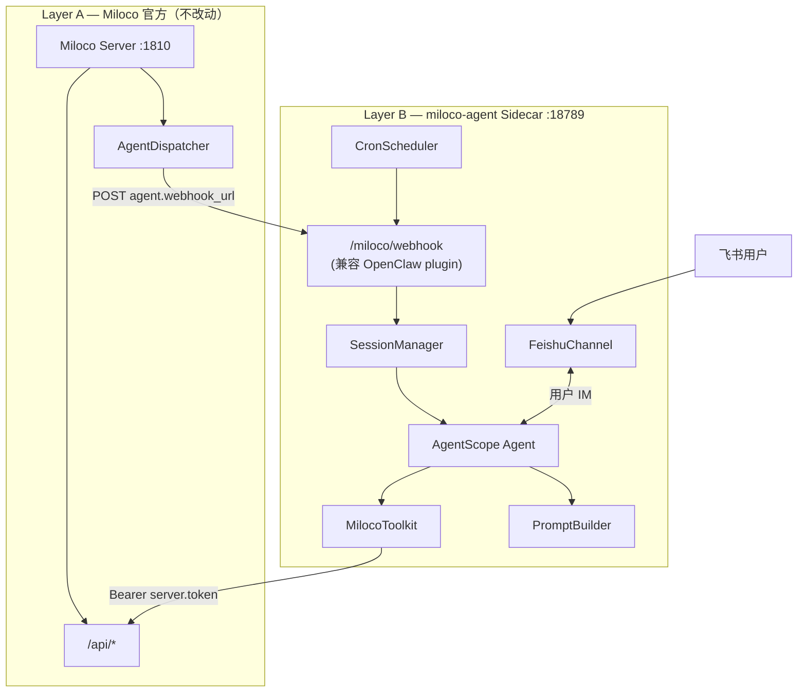

# Miloco Agent 替换 OpenClaw — 架构设计

> **Fork 专属** · 勿提交 [XiaoMi/xiaomi-miloco](https://github.com/XiaoMi/xiaomi-miloco)  
> **核心原则**：**不侵入 Miloco 官方代码**，独立 Sidecar 进程 + 配置对接，便于 `git merge upstream/main` 后继续使用。

---

## 1. 背景与目标

### 1.1 现状

| 组件 | 职责 |
|------|------|
| **Miloco Server** (`backend/miloco`) | 感知、规则、设备、任务、家庭记忆、AgentDispatcher |
| **OpenClaw Gateway + Plugin** (`plugins/openclaw`) | Agent 运行时、webhook、Skill、Cron、IM 工具 |
| **miloco-cli** | 调 Server API；被 Skill / 插件间接使用 |

Server 已通过 `AgentSettings`（`webhook_url` / `auth_bearer`）将 Agent **平台无关化**——注释写明「与具体 agent 平台无关」。这是零侵入替换的基础。

### 1.2 目标

| 目标 | 说明 |
|------|------|
| **去掉 OpenClaw 运行时** | 不再依赖 Node gateway、openclaw plugins install |
| **保留智能编排** | LLM + Tool 多步推理、主动事件处理、家庭记忆注入 |
| **飞书 IM** | 用户对话入口 + 主动通知主通道之一 |
| **默认 Agent 框架** | [AgentScope 2.x](https://github.com/agentscope-ai/agentscope) |
| **低侵入官方代码** | 新增代码全部在 fork 专属目录；官方目录零改动或仅文档级 |

### 1.3 非目标（首期）

- 不重写 Miloco 感知 / 规则 / 任务后端
- 不修改 `knowledge/` 官方知识库（除非日后向上游贡献）
- 不 1:1 复制 16 个 SKILL.md 全文（MVP 收敛为 Tool 注册表）
- 不在首期改动 `scripts/install.sh` / `build.sh`（提供 fork 独立启动脚本即可）

---

## 2. 设计原则：与官方代码的边界

### 2.1 三层隔离

```
┌─────────────────────────────────────────────────────────────┐
│  Layer A — 官方代码（随 upstream 合并，fork 尽量不碰）          │
│  backend/miloco  cli  web  plugins/skills  knowledge  scripts│
└───────────────────────────────┬─────────────────────────────┘
                                │ 仅通过已有契约交互：
                                │ ① config.json (agent.* / server.*)
                                │ ② HTTP /api/* + Bearer
                                │ ③ POST agent.webhook_url
┌───────────────────────────────▼─────────────────────────────┐
│  Layer B — Fork 专属 Sidecar（本方案全部落在这里）              │
│  miloco-agent/   docs/agent/   scripts/miloco-agent-*.sh     │
└───────────────────────────────┬─────────────────────────────┘
                                │
┌───────────────────────────────▼─────────────────────────────┐
│  Layer C — 用户运行时（不进 git）                              │
│  $MILOCO_HOME/config.json   miloco-agent 自有配置（可选）     │
└─────────────────────────────────────────────────────────────┘
```

### 2.2 允许 / 禁止 改动官方树

| 操作 | 官方目录 | 策略 |
|------|----------|------|
| 新增 Agent Sidecar | `miloco-agent/`（仓库根，fork 专属） | ✅ 推荐 |
| 改 webhook 契约 | `backend/.../agent_client.py` | ❌ 禁止；Sidecar **适配**现有契约 |
| 改 Dispatcher | `dispatch/dispatcher.py` | ❌ 禁止 |
| 扩展 `config.json` | `settings.schema.json` 中 `agent.additionalProperties: true` | ✅ **无需改 schema**；飞书等字段写进 config.json 即可 |
| 改 `install.sh` | `scripts/install.sh` | ⚠️ 首期不改；fork 提供 `scripts/miloco-agent-install.sh` |
| 改 OpenClaw 插件 | `plugins/openclaw` | ❌ 不修改；**用户侧停用**即可 |
| 复用 Skill 语义 | `plugins/skills/` | ✅ 只读参考，Tool 描述从 SKILL 提炼 |

### 2.3 合并上游工作流

```bash
git fetch upstream
git merge upstream/main          # 或 rebase
# 冲突应几乎只在 fork 专属路径；官方树保持干净
bash scripts/check-upstream-pr.sh   # 若开官方 PR
# 重启：miloco-cli service + miloco-agent（见运维章节）
```

**冲突面预期**：仅 `miloco-agent/`、`docs/`、`AGENTS.md`、`.fork-only` 等 fork 文件；`backend/`、`cli/`、`web/` 与 upstream 一致。

---

## 3. 目标架构

### 3.1 总览



### 3.2 进程与端口

| 进程 | 端口 | 启动 | 依赖 |
|------|------|------|------|
| Miloco Server | 1810（默认） | `miloco-cli service start` | 官方安装方式不变 |
| miloco-agent | 18789（默认） | `scripts/miloco-agent-run.sh` | Python ≥3.11 独立 venv |
| OpenClaw | — | **不启动** | 退役 |

### 3.3 配置对接（零代码侵入 Server）

用户 `$MILOCO_HOME/config.json`（官方已支持）：

```json
{
  "server": {
    "token": "<官方生成>",
    "host": "127.0.0.1",
    "port": 1810
  },
  "agent": {
    "webhook_url": "http://127.0.0.1:18789/miloco/webhook",
    "auth_bearer": "<miloco-agent 启动时写入或手动配置>"
  },
  "model": {
    "omni": { "...": "感知用，与 Agent 分离" }
  }
}
```

Sidecar **只读** `server.*` 调 API；**可选写** `agent.auth_bearer`（对齐 OpenClaw 插件曾有的副作用，但逻辑放在 Sidecar 安装脚本里，不改 Server 代码）。

飞书等扩展字段利用 `agent.additionalProperties: true` 写入同一文件，例如：

```json
{
  "agent": {
    "webhook_url": "...",
    "auth_bearer": "...",
    "provider": "agentscope",
    "feishu": {
      "app_id": "cli_xxx",
      "app_secret": "xxx",
      "verification_token": "xxx",
      "encrypt_key": "xxx"
    },
    "llm": {
      "base_url": "https://api.xiaomimimo.com/v1",
      "api_key": "sk-xxx",
      "model": "mimo-v2.5-pro"
    }
  }
}
```

Sidecar 专用配置也可放在 `miloco-agent/config.yaml`（fork 专属），通过环境变量 `MILOCO_AGENT_CONFIG` 指向，**避免改 Miloco settings.py**。

---

## 4. Webhook 兼容层（关键适配器）

Server 侧 `run_agent_turn`（`utils/agent_client.py`）已固定协议；Sidecar **必须实现与 OpenClaw plugin 等价行为**。

### 4.1 路由

`POST /miloco/webhook`  
Header: `Authorization: Bearer <agent.auth_bearer>`（若 config 非空）  
Body: `{ "action": string, "payload": object }`  
Response: `{ "code": 0, "message": "ok", "data": ... }`

### 4.2 Action: `agent`

**Request payload**（与现 plugin 一致）：

| 字段 | 类型 | 说明 |
|------|------|------|
| `message` | string | 投递给 Agent 的文本（dispatcher 已格式化） |
| `sessionKey` | string | 会话路由，见 §5 |
| `lane` | string | 车道标识（记录用） |
| `traceId` | string | 追踪 / 幂等 |
| `idempotencyKey` | string | 通常等于 traceId |
| `timeoutMs` | number | 同步等待上限 |
| `extraSystemPrompt` | string? | 可选追加 system |

**Response data**：

| 字段 | 说明 |
|------|------|
| `runId` | turn 唯一 ID（供 get_trace） |
| `status` | `ok` \| `error` \| `timeout` |
| `error` | 可选错误信息 |
| `recovered` | 可选；context 溢出自愈标记 |

**行为要求**：

1. 同 `sessionKey` 在途 turn ≤ 1（与 dispatcher 单飞对齐）
2. `idempotencyKey` 重复请求返回同一 in-flight / 已完成结果
3. 在 `timeoutMs` 内阻塞等待 AgentScope turn 结束
4. HTTP 超时 = `timeoutMs/1000 + 15s`（与 `_HTTP_BUFFER_S` 对齐）

### 4.3 Action: `get_trace`

**Request**: `{ "runId": string }`  
**Response data**:

| status | 含义 |
|--------|------|
| `in_progress` | turn 未结束 |
| `done` | 返回 meta 并清除内存 |
| `unknown` | 无此 runId |

meta 字段对齐 `observability/agent_meta_poller.py` 消费方（首期可简化：success、tool_calls、duration_ms）。

---

## 5. Session 模型

与 `dispatch/dispatcher.py` 中 `_ROUTE` **保持一致**，不修改 Server：

| event_type | sessionKey | 用途 | Prompt Profile |
|------------|------------|------|----------------|
| interaction | `agent:main:miloco` | 用户飞书对话、语音指令 | full |
| bind | `agent:main:miloco` | 新设备欢迎 | full |
| rule | `agent:main:miloco-rule` | DYNAMIC 规则 | rule |
| suggestion | `agent:main:miloco-suggest` | 感知建议 | suggestion |
| cron | `cron:miloco:*` 或消息前缀 `[cron:` | 后台任务 | minimal |

**飞书映射**：

```
feishu:im:{open_id}  →  绑定后并入 agent:main:miloco
                      或  独立 session（多用户时再议）
```

Session 状态存 Sidecar 本地 SQLite（`$MILOCO_HOME/agent/sessions.db`），**不进 miloco.db**。

---

## 6. AgentScope 集成

### 6.1 包结构（全部在 `miloco-agent/`，fork 专属）

```
miloco-agent/
├── pyproject.toml              # requires-python >=3.11；依赖 agentscope, fastapi, httpx
├── README.md
├── config.example.yaml
└── src/miloco_agent/
    ├── __main__.py             # python -m miloco_agent
    ├── app.py                  # FastAPI 应用
    ├── webhook/
    │   ├── router.py           # POST /miloco/webhook
    │   ├── agent_action.py
    │   └── get_trace_action.py
    ├── runtime/
    │   ├── session_manager.py
    │   ├── turn_runner.py      # AgentScope Agent 封装
    │   └── idempotency.py
    ├── prompt/
    │   ├── builder.py          # 移植 resolveProfile + 块装配
    │   └── blocks.py             # 从 prompt.ts 提炼的静态块
    ├── tools/
    │   ├── miloco_client.py    # httpx → localhost /api
    │   ├── toolkit.py          # AgentScope Toolkit 注册
    │   ├── devices.py
    │   ├── tasks.py
    │   ├── rules.py
    │   ├── persons.py
    │   └── notify.py           # 调 Feishu + miloco-cli notify（可选）
    ├── channels/
    │   └── feishu.py           # 入站 webhook + 出站消息
    ├── cron/
    │   ├── scheduler.py
    │   └── jobs.py             # digest / patrol / dreaming / habit-suggest
    ├── trace/
    │   └── store.py            # runId → meta 内存表
    └── config.py               # 读 MILOCO_HOME + 自有 yaml
```

### 6.2 模型

- **Agent LLM**：MiMo（OpenAI-compatible），配置在 Sidecar `agent.llm`
- **感知 Omni**：仍由 Server `model.omni` 控制，Sidecar **不替代**

### 6.3 Tool 策略（替代 16 Skill）

| 阶段 | Tool 数量 | 说明 |
|------|-----------|------|
| MVP | 6～8 | device_list/control、person_list、task_create、rule_list、perception_recent、notify_send |
| GA | 12～15 | 覆盖任务 record、scope、home_profile 写入等 |
| 长期 | 按需 | 从 `plugins/skills/*/SKILL.md` 增量提炼 |

每个 Tool：`async def` + `Toolkit.register_tool_function`，内部 **httpx 调 Server**，不 subprocess `miloco-cli`（减少 shell 依赖；调试时可保留 cli 回退）。

### 6.4 Notify 分层

| 层级 | 负责方 | 说明 |
|------|--------|------|
| **策略** | Python `notify/policy.py` | L1/L2/L3 分级、选人、渠道优先级（移植 miloco-notify 规则） |
| **文案** | AgentScope（可选） | 仅生成 message 文本 |
| **执行** | `channels/feishu.py` + device TTS tool | 真正发送 |

避免每次通知都跑完整 Agent 推理。

---

## 7. 飞书通道设计

### 7.1 能力矩阵

| 方向 | 飞书 API | Sidecar 模块 |
|------|----------|--------------|
| 入站 | 事件订阅 `im.message.receive_v1` | `feishu.py` HTTP handler `/feishu/webhook` |
| 出站 | `im/v1/messages` | `feishu.send_text(open_id, text)` |
| 鉴权 | `tenant_access_token` 缓存 | `feishu/auth.py` |
| 绑定 | 用户发「绑定 Miloco」 | 写 Sidecar `bindings` 表 |

### 7.2 与 Agent 衔接

```
飞书消息 → 验签 → 解析 open_id / text
  → SessionManager.get_or_create(feishu:im:{open_id})
  → TurnRunner.run(message, sessionKey=agent:main:miloco, profile=full)
  → 可选：将 Agent 文本回复 feishu.send
```

主动事件（rule/suggestion）仍走 **Server → miloco-agent webhook**，不由飞书触发；处理完后 `notify_send` 可走飞书。

### 7.3 MVP 简化

- 单用户：配置 `feishu.default_receive_open_id`，跳过绑定流程
- 群聊：二期（需 @bot 解析）

---

## 8. Cron 后台任务

OpenClaw `home-profile/scheduler.ts` 四条任务迁到 Sidecar `cron/jobs.py`：

| Job | 频率（对齐官方） | session | 行为 |
|-----|------------------|---------|------|
| miloco-perception-digest | 高频 | minimal | 调 tool / 固定 prompt 模板 |
| miloco-home-patrol | 中频 | minimal | 同上 |
| miloco-home-dreaming | 每日 | minimal | observe → promote → prune 可拆子步 |
| miloco-habit-suggest | 每日 | minimal | 习惯推荐 |

实现：`APScheduler` + asyncio，进程内与 FastAPI 共存。  
**任务 cron（用户创建的任务）**：二期对接 Server `task` + `agent_pending` 清理语义。

---

## 9. 可观测与运维

| 项 | 方案 |
|----|------|
| 日志 | `$MILOCO_HOME/log/miloco-agent.log` |
| Trace | Sidecar `trace/store.py` + 兼容 `get_trace` |
| 健康 | `GET /health` on :18789 |
| 与 Server 联调 | `miloco-cli admin status` + dispatcher 日志 |

**不修改** Server `observability/`；`AgentMetaPoller` 继续 poll `get_trace`，Sidecar 返回兼容 meta 即可。

---

## 10. 部署拓扑

### 10.1 开发机

```bash
# 终端 1 — 官方 Server（不变）
miloco-cli service start

# 终端 2 — Fork Sidecar
cd miloco-agent && uv sync && uv run python -m miloco_agent

# config.json 已指向 :18789 webhook
```

### 10.2 生产（单机）

```
supervisor / launchd
  ├─ miloco-backend    （官方 miloco-cli service）
  └─ miloco-agent      （fork 脚本）
```

可选：fork 提供 `scripts/miloco-agent-supervisor.conf` 示例，**不改**官方 supervisor 配置。

### 10.3 退役 OpenClaw

用户操作（非代码侵入）：

```bash
# 不再执行
openclaw plugins install ...
openclaw gateway restart
```

---

## 11. 风险与对策

| 风险 | 对策 |
|------|------|
| upstream 改 webhook 契约 | Sidecar 适配层单测 + 锁定契约文档；关注 `agent_client.py` changelog |
| Python 3.11 与官方 3.10 分裂 | Sidecar **独立 venv**，不并入 backend workspace |
| AgentScope API 变更 | 锁定版本上界；抽象 `TurnRunner` 接口 |
| 行为与 OpenClaw 不一致 | 分 session 对照测试；保留 OpenClaw 灰度环境 |
| 飞书 API 限流 | token 缓存、发送队列 |
| config 双写 | 安装脚本只改 `agent.webhook_url` / `auth_bearer` 两字段 |

---

## 12. 与官方文档关系

| 文档 | 用途 |
|------|------|
| [knowledge/03-features/openclaw-integration.md](../../knowledge/03-features/openclaw-integration.md) | **行为参考**（dispatcher、Skill 语义） |
| 本文 | Sidecar 替换架构 |
| [DEVELOPMENT_PLAN.md](./DEVELOPMENT_PLAN.md) | 分期实施 |
| [../DEVELOPMENT.md](../DEVELOPMENT.md) | Miloco 整体地图 |

---

## 13. 架构决策记录（ADR）

| ID | 决策 | 理由 |
|----|------|------|
| ADR-01 | Sidecar 独立包 `miloco-agent/` | 零侵入官方树，合并友好 |
| ADR-02 | 兼容现有 webhook，不改 Server | `AgentSettings` 已平台无关 |
| ADR-03 | AgentScope 为默认框架 | Python 同生态、Toolkit、多 session |
| ADR-04 | Tool 直调 HTTP API | 少依赖 miloco-cli 子进程 |
| ADR-05 | 飞书自研 channel | AgentScope 无官方飞书适配 |
| ADR-06 | Notify 策略代码化 | 降本、稳态 |
| ADR-07 | Session DB 在 Sidecar | 不改 miloco.db schema |
