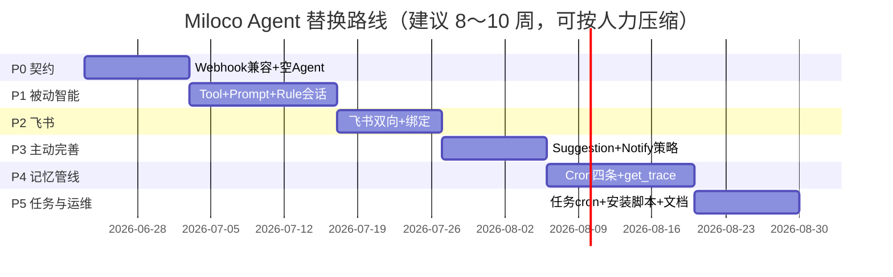

# Miloco Agent 替换 OpenClaw — 开发计划

> **Fork 专属** · 配套 [ARCHITECTURE.md](./ARCHITECTURE.md)  
> **原则**：所有实现落在 `miloco-agent/`、`docs/agent/`、`scripts/miloco-agent-*`；**不修改** `backend/miloco`、`cli`、`web` 官方树（合并 upstream 零冲突）。

---

## 1. 里程碑总览



| 阶段 | 周期（估） | 交付物 | 官方代码改动 |
|------|------------|--------|--------------|
| **P0** | 1～1.5 周 | Sidecar 骨架 + webhook 通 | **0** |
| **P1** | 2 周 | DYNAMIC 规则端到端 | **0** |
| **P2** | 1～1.5 周 | 飞书对话 | **0** |
| **P3** | 1～1.5 周 | 感知建议 + 分级通知 | **0** |
| **P4** | 2 周 | 家庭记忆 Cron + trace | **0** |
| **P5** | 1～1.5 周 | 任务 cron + 运维脚本 | **0**（仅 fork 脚本） |

---

## 2. 仓库与 Git 策略

### 2.1 Fork 专属路径（加入 `.fork-only`）

```
miloco-agent/                    # 新增 Python 包（主体）
docs/agent/                      # 架构 + 本计划
scripts/miloco-agent-install.sh
scripts/miloco-agent-run.sh
scripts/miloco-agent-supervisor.conf.example
```

### 2.2 合并上游检查清单

每次 `merge upstream/main` 后：

- [ ] `backend/`、`cli/`、`web/` 无本地 diff
- [ ] `miloco-agent` 测试通过
- [ ] 阅读 upstream `agent_client.py`、`dispatcher.py` release note
- [ ] `bash scripts/check-upstream-pr.sh`（若向官方 PR）
- [ ] 重启 `miloco-cli service` + `miloco-agent`

### 2.3 分支建议

| 分支 | 用途 |
|------|------|
| `main` | fork 日常；含 fork 专属 + 定期 merge upstream |
| `feat/agent-p0` … | 按阶段开发 |
| `upstream-pr/*` | 仅官方功能，从 `upstream/main` 拉出，**不带** miloco-agent |

---

## 3. P0 — Sidecar 骨架与 Webhook 契约（Week 1）

### 3.1 目标

Server `AgentDispatcher` 能把事件 POST 到 Sidecar 并收到合法响应（即使 Agent 仅 echo）。

### 3.2 任务清单

| # | 任务 | 产出 |
|---|------|------|
| P0-1 | 初始化 `miloco-agent/pyproject.toml`（py≥3.11, fastapi, httpx, agentscope） | 可 `uv sync` |
| P0-2 | `app.py` + `GET /health` | 健康检查 |
| P0-3 | `webhook/router.py` 实现 `{code,message,data}` 封装 | 与 plugin 响应形一致 |
| P0-4 | `agent` action：解析 payload，返回 `{runId, status: ok}` | 通过 `agent_client` 单测对照 |
| P0-5 | `get_trace` action：stub `in_progress` / `done` | poller 不报错 |
| P0-6 | Bearer 鉴权中间件（读 config `agent.auth_bearer`） | 对齐 gateway auth |
| P0-7 | `config.py` 读 `$MILOCO_HOME/config.json` + 环境变量 | 不改 Server settings |
| P0-8 | `scripts/miloco-agent-run.sh` | 一键启动 |
| P0-9 | 契约测试：`tests/test_webhook_contract.py` | 锁定 JSON schema |

### 3.3 验收标准

```bash
# 1. 改 config.json
#    agent.webhook_url = http://127.0.0.1:18789/miloco/webhook
# 2. 启动 Server + Sidecar
curl -X POST http://127.0.0.1:18789/miloco/webhook \
  -H "Authorization: Bearer <token>" \
  -H "Content-Type: application/json" \
  -d '{"action":"agent","payload":{"message":"ping","sessionKey":"agent:main:miloco-rule","traceId":"t1","timeoutMs":5000}}'
# 期望 code=0, data.status in ok|error|timeout
```

### 3.4 官方代码改动

**无。**

---

## 4. P1 — AgentScope + 被动智能（Week 2～3）

### 4.1 目标

DYNAMIC 规则触发后，Agent 能查设备并执行动作（至少一条完整链路）。

### 4.2 任务清单

| # | 任务 | 产出 |
|---|------|------|
| P1-1 | `TurnRunner` 封装 AgentScope `Agent` + `reply` | 可配置 MiMo |
| P1-2 | `SessionManager`：按 sessionKey 隔离历史 | 单飞锁 |
| P1-3 | `idempotency.py`：idempotencyKey 去重 | 对齐 dispatcher |
| P1-4 | `miloco_client.py`：httpx + `server.token` | 调 /api |
| P1-5 | Tools：`device_list`, `device_control` | Toolkit 注册 |
| P1-6 | `prompt/builder.py`：`rule` profile 最小集 | 移植 resolveProfile |
| P1-7 | `agent` action 接入 TurnRunner + timeout | 真实 turn |
| P1-8 | 集成测试：手动 `rule trigger` 或模拟 dispatch | 端到端 |

### 4.3 验收标准

- 创建一条 DYNAMIC 规则，感知命中后日志显示 webhook `status=ok`
- Agent 至少调用 1 次 device tool
- 同 sessionKey 并发 dispatch 不击穿单飞

### 4.4 官方代码改动

**无。**

---

## 5. P2 — 飞书 IM（Week 4～5）

### 5.1 目标

飞书私聊发「列出设备」→ Agent 回复文本。

### 5.2 任务清单

| # | 任务 | 产出 |
|---|------|------|
| P2-1 | 飞书开放平台应用配置文档（fork `docs/agent/FEISHU_SETUP.md`） | 运维可复现 |
| P2-2 | `feishu/auth.py` tenant_access_token | 自动刷新 |
| P2-3 | `POST /feishu/webhook` 验签 + 解密 | 接收消息 |
| P2-4 | 消息 → `TurnRunner`（session=full） | 对话 |
| P2-5 | 回复路径 `feishu.send_text` | 出站 |
| P2-6 | MVP：`default_receive_open_id` 配置 | 免绑定 |
| P2-7 | `bindings` 表 + 「绑定」口令（可选） | 多人预备 |
| P2-8 | 飞书多轮上下文（按 `open_id` 会话 + 历史 N 轮） | ✅ |

### 5.5 待办：飞书对话上下文（P2+）

> 当前每轮新建 Agent，**无**跨消息记忆。后续在不改 `backend/` 前提下补齐。

| # | 任务 | 说明 |
|---|------|------|
| P2+-1 | `session_key=feishu:{open_id}` | 按用户隔离 |
| P2+-2 | `runtime/session_store.py` | 进程内或 `$MILOCO_HOME/agent/sessions/` 持久化最近 N 轮 |
| P2+-3 | TurnRunner 复用 Agent 状态或注入 history | 支持「刚才那个灯」类指代 |
| P2+-4 | 配置 `agent.feishu.history_turns` / TTL | 可关停或限长 |

### 5.3 验收标准

- 飞书发消息，10s 内收到 Agent 文本回复
- Server 感知/规则不受影响
- 停掉 OpenClaw 后仍可对话

### 5.4 官方代码改动

**无。**

---

## 6. P3 — 主动建议与通知（Week 5～6）

### 6.1 目标

`suggestion` 事件 → 分级通知 → 飞书送达（L3 场景）。

### 6.2 任务清单

| # | 任务 | 产出 |
|---|------|------|
| P3-1 | `prompt`：`suggestion` profile | ✅ 感知格式 + notify 指引 |
| P3-2 | `notify/policy.py`：L1/L2/L3 + 选人 | ✅ 渠道路由（简化版） |
| P3-3 | Tool `notify_send` 或直调 policy | ✅ `notify_send` |
| P3-4 | `device_speaker_tts` tool（调 /api/miot） | ✅ play-text |
| P3-5 | 联调：模拟 suggestion dispatch | ✅ 契约测试 |

### 6.3 验收标准

- 人工注入 suggestion 事件，家人收到飞书或音箱播报（按策略）
- L1 场景全家通知逻辑可验证（可用 mock）

### 6.4 官方代码改动

**无。**

---

## 7. P4 — Cron 与家庭记忆管线（Week 7～8）

### 7.1 目标

四条 home-profile 定时任务在 Sidecar 内运行；`get_trace` 返回可用 meta。

### 7.2 任务清单

| # | 任务 | 产出 |
|---|------|------|
| P4-1 | `cron/scheduler.py` APScheduler | ✅ 默认关闭，配置开启 |
| P4-2 | 四 job 定义 + minimal prompt 模板 | ✅ 对齐 scheduler.ts |
| P4-3 | Tools：`home_profile_*`, `perception_logs`, `memory_perception_*` | ✅ |
| P4-4 | `trace/store.py` 记录 turn meta | ✅ |
| P4-5 | `get_trace` 完整实现 | ✅ |
| P4-6 | `prompt`：`full` profile + catalog 缓存 | ✅ |

### 7.3 验收标准

- 24h 内 digest job 至少执行 1 次（可调频率做测试）
- `profile.md` 有增量更新痕迹
- Web `#perf` 或 admin 能看到 agent run 统计（若 upstream 支持）

### 7.4 官方代码改动

**无。**

---

## 8. P5 — 任务 Cron、运维与 GA（Week 9～10）

### 8.1 目标

可日常家用；文档齐全；安装可重复。

### 8.2 任务清单

| # | 任务 | 产出 |
|---|------|------|
| P5-1 | 用户任务 cron 执行器（读 Server task API） | ✅ `cron/user_registry.py` |
| P5-2 | `agent_pending` 清理协议对齐 | ✅ task_disable/delete + cron ops |
| P5-3 | `scripts/miloco-agent-install.sh` | ✅ |
| P5-4 | supervisor 示例配置 | ✅ |
| P5-5 | `miloco-agent/README.md` 用户手册 | ✅ |
| P5-6 | 对照清单：OpenClaw 功能退役表 | ✅ miloco-agent/README |
| P5-7 | 可选：Docker Compose（Server + Agent） | ❌ 不做（见 §8.5） |

### 8.5 部署：为何不做 Docker Compose

Miloco Server 需与摄像头处于**同一 LAN**，才能拉流/感知。默认 bridge 网络的容器与宿主机/局域网隔离，摄像头不可达。

| 方式 | 建议 |
|------|------|
| **本机 / NAS 直跑** | ✅ 推荐：`miloco-cli service` + `miloco-agent-run.sh` |
| **supervisor 7×24** | ✅ 见 `scripts/miloco-agent-supervisor.conf.example` |
| **Docker Compose（bridge）** | ❌ 不推荐：破坏摄像头内网可达性 |
| **Docker `network_mode: host`** | ⚠️ 仅当必须容器化时再评估；macOS Docker 对 host 网络支持有限，Linux 家用机可行 |

### 8.3 验收标准

- 新机器按文档 30 分钟内跑通（无 OpenClaw）
- `git merge upstream/main` 后 15 分钟内恢复服务
- 核心场景回归表全部通过（§9）

### 8.4 官方代码改动

**无。**

---

## 8.6 P6 — 管理配置平台

> 详 [ADMIN_PLATFORM.md](./ADMIN_PLATFORM.md)

### 目标

在不改 `backend/` / `web/` 前提下，提供 Agent 侧 LLM / 飞书 / Cron 的可视化配置与运维入口。

### 任务清单

| # | 任务 | 产出 |
|---|------|------|
| P6-1 | `/admin/api/*` REST | ✅ status / config / reload / crons / sessions |
| P6-2 | 脱敏读写 `config.json` `agent.*` | ✅ `admin/config_io.py` |
| P6-3 | 静态管理台 `/admin` | ✅ `admin/static/index.html` |
| P6-4 | pytest + 文档 | ✅ `test_admin.py` |

### 验收标准

- 浏览器打开 `http://127.0.0.1:18789/admin` 可查看状态并保存 Cron/LLM/飞书配置
- `PATCH /admin/api/config` + `POST /admin/api/reload` 后 Cron 开关生效
- 密钥在 API 响应中脱敏

---

## 9. 回归测试矩阵

| 场景 | 触发方式 | 期望 |
|------|----------|------|
| 健康检查 | `curl /health` ×2 | Server + Agent 均 200 |
| 设备控制 | 飞书「开客厅灯」 | 灯亮 + 回复 |
| DYNAMIC 规则 | 规则命中 | webhook ok + 动作 |
| STATIC 规则 | 感知命中 | **不经 Agent**，设备直接动 |
| 设备欢迎 | 绑定新设备 | 飞书/TTS 欢迎 |
| 感知建议 | suggestion 事件 | 通知送达 |
| 语音指令 | interaction | 任务/设备 |
| Token 用量 | 面板模型页 | Server 统计正常 |
| 合并上游 | merge upstream/main | 无 backend 冲突 |

---

## 10. OpenClaw 功能退役对照

| OpenClaw 能力 | Sidecar 替代 | 阶段 |
|---------------|--------------|------|
| `/miloco/webhook` | `miloco-agent/webhook` | P0 |
| Agent turn | AgentScope TurnRunner | P1 |
| 16 Skill | MilocoToolkit | P1～P4 |
| before_prompt_build | prompt/builder.py | P1～P4 |
| miloco_im_push | feishu + notify/policy | P2～P3 |
| home-profile cron | cron/jobs.py | P4 |
| trace hook | trace/store.py | P4 |
| plugin 拉启 backend | 用户自行 `miloco-cli service` | 运维 |
| OpenClaw gateway | **删除依赖** | P2 起 |

---

## 11. 人力与技能

| 角色 | 技能 |
|------|------|
| 后端 | Python asyncio、FastAPI、读 Miloco dispatcher |
| Agent | AgentScope Toolkit、prompt 工程 |
| 集成 | 飞书开放平台、httpx |
| 运维 | supervisor、合并 upstream |

单人可串行 P0→P5；建议 P2 飞书与 P1 工具层可并行两人。

---

## 12. 依赖版本建议（锁定）

```toml
# miloco-agent/pyproject.toml 片段
requires-python = ">=3.11"
dependencies = [
  "agentscope>=2.0,<3",
  "fastapi>=0.115",
  "uvicorn[standard]>=0.32",
  "httpx>=0.28",
  "apscheduler>=3.10",
  "pydantic>=2.10",
  "pycryptodome>=3.21",  # 飞书事件解密（若启用）
]
```

**不**将 agentscope 加入 `backend/pyproject.toml`，避免污染官方 workspace。

---

## 13. 配置迁移指南（OpenClaw → Sidecar）

用户操作，无需改代码：

1. 安装官方 Miloco（`install.sh --dev` 或 release）——**不变**
2. 停 OpenClaw gateway
3. `bash scripts/miloco-agent-install.sh` 写 `agent.webhook_url` / 生成 `auth_bearer`
4. 配置 `agent.feishu` / `agent.llm` / `agent.cron`（Sidecar 读 config.json 扩展字段）
5. 启动 `scripts/miloco-agent-run.sh`
6. `miloco-cli service restart`（若已在跑）

Cron 可选：`"agent": { "cron": { "enabled": true, "timezone": "Asia/Shanghai" } }`（默认关闭）。

---

## 14. 后续演进（非首期）

| 项 | 说明 |
|----|------|
| 多 IM 渠道 | 抽象 `channels/base.py` |
| 飞书多轮上下文 | ✅ `session_store` + `history_turns`（§5.5） |
| 分机部署 | Sidecar 与 Server 分机器（同内网）；当前默认同机 |
| 合入官方 optional extra | 仅当小米接受架构后，再议 `miloco[agent]` |
| Skill 自动生成 Tool | 从 SKILL.md 批量生成 schema |
| Web 面板 Agent 状态 | 需官方 API 扩展时再提 PR |
| Python 3.11 统一 | 仅当 upstream 升级后 Sidecar 可并入 workspace |

---

## 15. 文档索引

| 文档 | 路径 |
|------|------|
| 架构设计 | [ARCHITECTURE.md](./ARCHITECTURE.md) |
| 本开发计划 | [DEVELOPMENT_PLAN.md](./DEVELOPMENT_PLAN.md) |
| Miloco 总览 | [../DEVELOPMENT.md](../DEVELOPMENT.md) |
| OpenClaw 行为参考 | [../../knowledge/03-features/openclaw-integration.md](../../knowledge/03-features/openclaw-integration.md) |
| 飞书配置（P2 补充） | `FEISHU_SETUP.md`（待写） |
